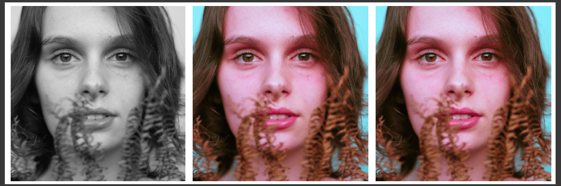

# Black & White Image Colorization

In this repo you can experience how deep learning frameworks capability of colorization of black and white images .This domain is more complicated than we think because colors need to have precious values otherwise that colorization will not be perfect matching into the scene .



## Installation

Use the package manager [pip](https://pip.pypa.io/en/stable/) to install below packages.

```bash
pip install opencv
pip install Keras==2.2.0
```

## Usage

```python
1. colornet.ipynb -- use this notebook to generate results
```

## Results


## Contributing
Pull requests are welcome. For major changes, please open an issue first to discuss what you would like to change.

Please make sure to update tests as appropriate.

## License
Apache License 2.0